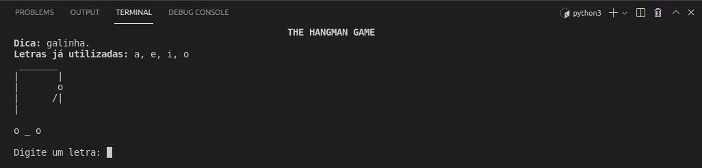
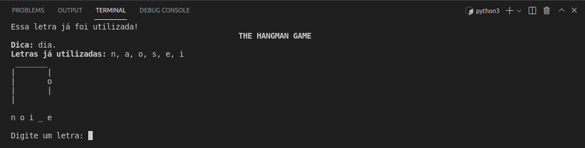

# Hangman Game
Jogo da forca escrito em Python.

# Depedências
- Instale o módulo `unidecode` com o comando `python3 -m pip install unidecode`.

# Como rodar o projeto
```shell
git clone https://github.com/felipesantoos/hangman-game.git
cd hangman-game
python3 -m pip install unidecode
python3 main.py
```

# Screenshots




